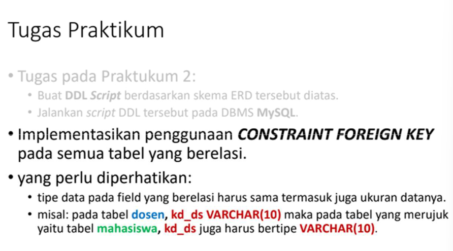

#Praktikum3_SQL

`Nama  : Faizah Via Fadhillah`
`NIM   : 312210460`
`Kelas : TI.22.A.4`

## SQL Constraint

- SQL Constraint digunakan untuk menentukan aturan untuk data dalam tabel.
- Constraint digunakan untuk membatasi jenis data yang bisa masuk ke tabel. Ini memastikan keakuratan dan keandalan data dalam tabel.
- Constraint dapat berupa level kolom atau level tabel.
- Constraint level kolom berlaku untuk kolom, dan batasan level tabel berlaku untuk seluruh tabel.



# Tugas Praktikum 3

1. Lakukan penambahan data pada tabel mahasiswa dengan mengisi kd_ds yang belum ada pada data dosen.

```sql
CREATE TABLE Mahasiswa (
    nim VARCHAR(10) PRIMARY KEY,
    nama VARCHAR(50) NOT NULL,
    jenis_kelamin ENUM('Laki-laki', 'Perempuan') NOT NULL,
    tgl_lahir DATE NOT NULL,
    jalan VARCHAR(100)DEFAULT NULL,
    kota VARCHAR(50) NOT NULL,
    kodepos VARCHAR(10) DEFAULT NULL,
    no_hp VARCHAR(20) DEFAULT NULL,
    kd_ds VARCHAR(10) NOT NULL,
    CONSTRAINT FK_DosenWali FOREIGN KEY (kd_ds) REFERENCES Dosen(kd_ds)
);
```

2. Hapus satu record data pada tabel dosen yang telah dirujuk pada tabel mahasiswa.

```sql
DELETE FROM Dosen WHERE kd_ds = 'DS002';
```
KETERANGAN : Terjadi error dikarenakan `kd_ds` pada tabel Mahasiswa merupakan FOREIGN KEY dari tabel refensinya yaitu tabel Dosen. Dan pada tabel Dosen `kd_ds` merupakan PRIMARY KEY. Itu artinya, tabel Dosen sebagai tabel parent/references dan Mahasiswa sebagai tabel child maka dari itu saat menghapus satu record data pada tabel dosen terjadi error.

3. Ubah mode menjadi ON UPDATE CASCADE ON DELETE RESTRICT

```sql
ALTER TABLE Mahasiswa DROP FOREIGN KEY FK_DosenWali;
ALTER TABLE Mahasiswa ADD CONSTRAINT FK_DosenMahasiswa FOREIGN KEY
(kd_ds) REFERENCES Dosen(kd_ds) ON UPDATE CASCADE ON DELETE
RESTRICT
```

4. Lakukan perubahan data pada tabel dosen (kd_ds)

```sql
UPDATE Dosen SET kd_ds = 'DS007' WHERE kd_ds = 'DS005';
```
KETERANGAN : `kd_ds` dapat diubah dikarenakan sebelumnya menggunakan `ON UPDATE CASCADE`

5. Lakukan penghapusan data pada tabel dosen

```sql
DELETE FROM Dosen WHERE kd_ds = 'DS001';
```
KETERANGAN : Terjadi ERROR

6. Ubah mode menjadi ON UPDATE CASCADE ON DELETE SET NULL
```sql
ALTER TABLE Mahasiswa DROP FOREIGN KEY FK_DosenMahasiswa;
ALTER TABLE Mahasiswa ADD CONSTRAINT FK_DosenWali FOREIGN
KEY(kd_ds) REFERENCES Dosen(kd_ds) ON UPDATE CASCADE ON DELETE SET
NULL;
```

7. Lakukan penghapusan data pada tabel dosen

```sql
DELETE FROM Dosen WHERE kd_ds = 'DS001';
```

# Evaluasi dan Pertanyaan

* Apa bedanya penggunaan RESTRICT dan penggunaan CASCADE?

Restrict = yaitu perubahan data dan penghapusan data tidak diijinkan pada tabel referensi (parent table) apabila pada tabel child sudah ada yang merujuk pada data tersebut.
Cascade = yaitu perubahan atau penghapusan data pada tabel referensi (parent table) akan diikuti oleh tabel child

* Berikan kesimpulan anda!

Dalam kesimpulannya, RESTRICT dan CASCADE digunakan untuk mengatur perilaku ketika ada perubahan atau penghapusan data pada tabel utama. Jika digunakan dengan benar, ini dapat membantu memastikan integritas referensial dan konsistensi data antara tabel-tabel yang saling berhubungan.
